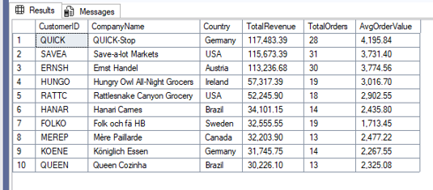
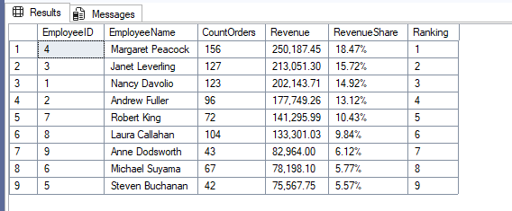
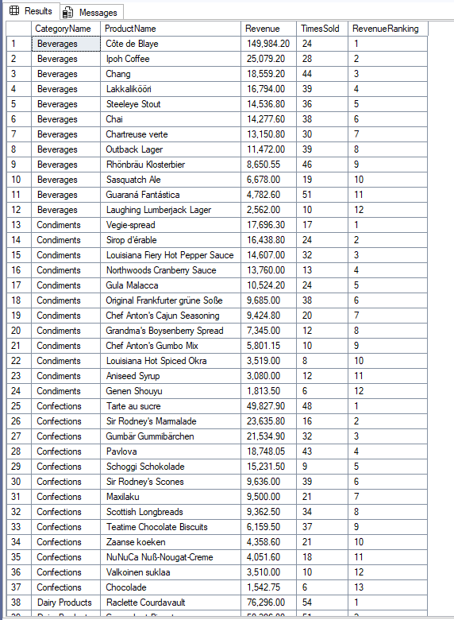
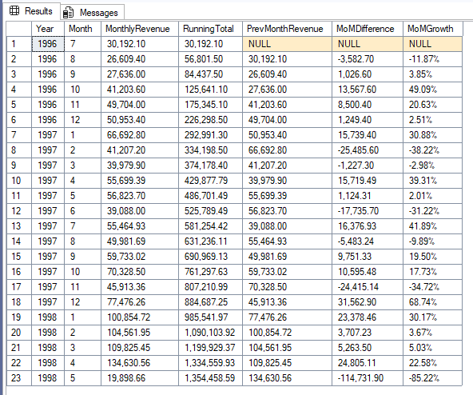
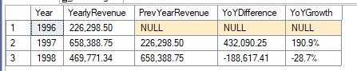

# Northwind Business Performance Analysis

T-SQL analysis of the Northwind database answering real business questions using 
advanced SQL techniques — CTEs, window functions, subqueries, and time intelligence.

## 🗄️ Database
**Northwind** — a classic sales database containing 830 orders, 91 customers, 
77 products across 8 categories, managed by 9 employees.

| Table | Rows |
|-------|------|
| Customers | 91 |
| Orders | 830 |
| Order Details | 2,155 |
| Products | 77 |
| Employees | 9 |

## 📊 Business Questions Answered

| # | File | Business Question | Skills |
|---|------|------------------|--------|
| 1 | [01_top_customers.sql](01_top_customers.sql) | Who are the top 10 customers by revenue? | INNER JOIN (3 tables), GROUP BY, FORMAT |
| 2 | [02_employee_performance.sql](02_employee_performance.sql) | Which employees drive the most revenue? What % of total? | CTEs (x2), CROSS JOIN, RANK() |
| 3 | [03_category_revenue.sql](03_category_revenue.sql) | Which product categories sell best? How does each product rank within its category? | CTE, RANK() with PARTITION BY |
| 4 | [04_monthly_trends.sql](04_monthly_trends.sql) | What does monthly revenue look like over time? | CTE, LAG(), SUM() OVER, running total, MoM growth % |
| 5 | [05_yoy_growth.sql](05_yoy_growth.sql) | How does revenue grow year over year? | CTE, LAG(), NULLIF(), time intelligence |

## 🔍 Query Results

### 01 — Top 10 Customers by Revenue

### 02 — Employee Performance & Revenue Share

### 03 — Category Revenue with Product Ranking

### 04 — Monthly Revenue Trends with Running Total

### 05 — Year over Year Revenue Growth

## 🛠️ Tools & Skills
- **Database:** Microsoft SQL Server (T-SQL)
- **IDE:** SQL Server Management Studio (SSMS) 21
- **Techniques:** INNER JOIN, LEFT JOIN, GROUP BY, HAVING, CTEs, 
  correlated subqueries, window functions (RANK, ROW_NUMBER, LAG, 
  running totals), time intelligence (YEAR, MONTH, DATEPART, DATEDIFF)

## 📁 Repository Structure

| File | Description |
|------|-------------|
| `01_top_customers.sql` | Top 10 customers by revenue |
| `02_employee_performance.sql` | Employee revenue & % of total |
| `03_category_revenue.sql` | Category revenue with product ranking |
| `04_monthly_trends.sql` | Monthly trends, running total, MoM growth |
| `05_yoy_growth.sql` | Year over year revenue growth |
| `screenshots/` | Query result screenshots |
| `README.md` | Project documentation |

---
*Part of my data analytics portfolio. Tools: T-SQL · SQL Server · Power BI*